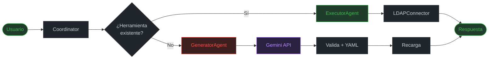

<div align="center">

```
    ___    ____  ____                           __
   /   |  / __ \/  _/___  _________  ___  _____/ /_____  _____
  / /| | / / / // // __ \/ ___/ __ \/ _ \/ ___/ __/ __ \/ ___/
 / ___ |/ /_/ // // / / (__  ) /_/ /  __/ /__/ /_/ /_/ / /
/_/  |_/_____/___/_/ /_/____/ .___/\___/\___/\__/\____/_/
                            /_/
          Agentic Active Directory Security Analyzer
```

**Offensive Security Team**


</div>

<br>

## Índice

- [¿Qué es ADInspector?](#qué-es-adinspector)
- [Flujo de ejecución](#flujo-de-ejecución)
- [Arquitectura](#arquitectura)
- [Herramientas disponibles](#herramientas-disponibles)
- [Instalación y uso](#instalación-y-uso)
- [Seguridad implementada](#seguridad-implementada)
- [Criterios del challenge](#criterios-del-challenge--estado)
- [Stack tecnológico](#stack-tecnológico)
- [Estructura del proyecto](#estructura-del-proyecto)

---

## ¿Qué es ADInspector?

ADInspector es un sistema multi-agente de IA diseñado para **reconocimiento y análisis ofensivo de dominios LDAP / Active Directory**. Combina consultas directas al servidor LDAP con generación automática de nuevas herramientas vía **Gemini 2.0 Flash** cuando se detecta que ninguna herramienta existente puede responder la consulta del operador.

<table>
<tr>
<td width="50%" valign="top">

#### 🤖 Auto-Expansión
Cuando una consulta no puede responderse, Gemini genera código Python nuevo, lo valida, lo persiste y recarga el agente en tiempo real.

</td>
<td width="50%" valign="top">

#### 🔴 Enfoque Ofensivo
12 herramientas que mapean las fases de un engagement: Recon → Enumeration → Credential Access → Privilege Escalation.

</td>
</tr>
<tr>
<td width="50%" valign="top">

#### 🏗️ Multi-Agente
Coordinator + ExecutorAgent + GeneratorAgent con responsabilidades claras y flujo de orquestación explícito.

</td>
<td width="50%" valign="top">

#### 💾 Persistencia
Herramientas generadas se guardan en YAML con hash SHA-256. Se recargan automáticamente en la próxima sesión.

</td>
</tr>
</table>

---

## Flujo de ejecución



---

## Arquitectura

```
┌───────────────────────────────────────────────────────────────────┐
│                     CLI (interactive.py)                          │
│   Comandos • Routing • Formateo por tipo de dato • Manejo errores │
└───────────────────────────────┬───────────────────────────────────┘
                                │
┌───────────────────────────────▼───────────────────────────────────┐
│                      Coordinator (agents.py)                      │
│   Analiza capacidades • Elige estrategia • Gestiona estado        │
└──────────────┬─────────────────────────────┬──────────────────────┘
               │                             │
┌──────────────▼──────────────┐  ┌───────────▼─────────────────────┐
│       ExecutorAgent         │  │        GeneratorAgent           │
│  ─────────────────────────  │  │  ─────────────────────────────  │
│  • Herramientas base (12)   │  │  • analyze_query() → Gemini     │
│  • Herramientas generadas   │  │  • generate_tool() → código     │
│  • Verifica hash SHA-256    │  │  • _validate_code() → compile() │
│  • exec() en sandbox        │  │  • register → YAML + hash       │
└──────────────┬──────────────┘  └─────────────────────────────────┘
               │
┌──────────────▼──────────────┐  ┌─────────────────────────────────┐
│       LDAPConnector         │  │       ToolRegistry (YAML)       │
│  ─────────────────────────  │  │  ─────────────────────────────  │
│  • Escape de filtros        │  │  • Persistencia entre sesiones  │
│  • Reconexión automática    │  │  • Hash SHA-256 por herramienta │
│  • Decode bytes → str       │  │  • load() / save() / reset()    │
└──────────────┬──────────────┘  └─────────────────────────────────┘
               │
┌──────────────▼──────────────┐
│   OpenLDAP (dc=meli,dc=com) │
└─────────────────────────────┘
```

### Patrones de diseño

| Patrón | Descripción |
|---|---|
| **Singleton** | `get_ldap_connector()` y `get_tool_registry()` — una instancia global por proceso. |
| **Strategy** | Coordinator elige entre `ExecutorAgent` (existente) y `GeneratorAgent` (generar nueva). |
| **Registry** | `ALL_TOOLS` (base) + `ToolRegistry` YAML (generadas). Dos niveles con diferente ciclo de vida. |
| **Chain of Responsibility** | Query → `infer_tool` → Gemini `analyze` → Gemini `generate` → `exec` sandbox → LDAP. |

---

## Herramientas disponibles

### 🔵 Base (obligatorias)

| Herramienta | Comando CLI | Descripción |
|---|---|---|
| `get_current_user_info()` | `whoami` | Usuario de sistema + datos LDAP + grupos |
| `get_user_groups(username)` | `user-info` | Grupos directos de un usuario específico |

### 🔴 Ofensivas (12 total)

| Herramienta | CLI | Fase | Descripción |
|---|---|---|---|
| `get_domain_info()` | `domain` | 🔵 Recon | Estructura del dominio, Base DN, servidor |
| `get_all_users()` | `users` | 🔵 Recon | Todos los usuarios. Detecta cuentas de servicio (`svc_*`, `bot_*`) |
| `get_all_groups()` | `groups` | 🟣 Enumeración |Todos los grupos con miembros. Detecta grupos sensibles |
| `get_user_full_info(username)` | `user-info` | 🔵 Recon | Todos los atributos LDAP de un usuario (incluyendo `pager`, `info`) |
| `get_user_memberships_recursive(username)` | `privilege` | 🔴 Privilege | Grupos directos + heredados. Detecta rutas de escalada |
| `get_all_computers()` | `computers` | 🔵 Recon | Equipos registrados en `ou=computers` |
| `get_all_shares()` | `shares` | 🔵 Recon | Recursos compartidos en `ou=shares` |
| `get_policies()` | `policies` | 🟠 Credential | Políticas de contraseñas + PSOs. Calcula umbral seguro para Password Spray |
| `get_spns()` | `spns` | 🟠 Credential | Cuentas con SPNs para Kerberoasting |
| `get_delegations()` | `delegation` | 🔴 Privilege | Delegación Unconstrained / Constrained / RBCD |
| `get_adcs_templates()` | `adcs-templates` | 🔴 Privilege | Templates ADCS. Detecta candidatos ESC1 / ESC2 / ESC3 |
| `get_gpos()` | `gpos` | 🟡 Lateral | Todas las GPOs con rutas SYSVOL |

### ✨ Auto-generadas (ilimitadas)

Cuando una consulta no puede responderse con herramientas existentes, el sistema genera automáticamente una nueva función Python vía Gemini, la valida y la persiste.

```
>>> ask "encontrar usuarios con descripción de contractor"
⚠️  No hay herramienta disponible para esta consulta.
🤖 Consultando con IA para crear una herramienta nueva...
✅ Nueva herramienta generada: search_contractor_users
```

---

## Instalación y uso

### 1. Levantar el entorno LDAP

```bash
cd open_ldap_files
./setup-ldap.sh
```

Dominio, Servidor, WebUI

### 2. Configurar variables de entorno

```bash
cp .env.example .env
# Editar .env y agregar GEMINI_API_KEY
```

### 3. Instalar dependencias y ejecutar

```bash
poetry install
poetry shell
poetry run python interactive.py
```

### Sesión de ejemplo

```
>>> whoami
👤 Usuario: john.doe
   Uid: john.doe  |  Mail: john.doe@meli.com
   Grupos: all_users, developers

>>> spns
🎫 Cuentas Kerberoasteables (SPNs): 2
    1. svc_ldap  (1 SPN)
       └─ ldap/dc01.meli.com
    2. svc_sql   (2 SPNs)
       └─ MSSQLSvc/sql01.meli.com:1433
   ⚡ Usar GetUserSPNs.py o Rubeus para solicitar TGS y crackear offline

>>> domain-enum-all
🌐 DOMAIN ENUM ALL — Enumeración Completa
────────────────────────────────────────
  🌐 Dominio ...
  👥 Usuarios ...
  📁 Grupos ...
  🔑 Políticas ...
  🎫 SPNs ...
  🔄 Delegación ...
```

---

## Seguridad implementada

<table>
<tr>
<td width="50%" valign="top">

**LDAP Injection Prevention**
`escape_filter_chars()` en todos los inputs antes de construir filtros. Previene `uid=*)) (&(objectClass=*`

</td>
<td width="50%" valign="top">

**Hash SHA-256 de herramientas**
Cada herramienta generada almacena su hash. Se verifica antes de ejecutar `exec()`. Hash incorrecto → herramienta ignorada.

</td>
</tr>
<tr>
<td width="50%" valign="top">

**Sandbox de ejecución**
`exec(code, namespace)` con namespace mínimo: solo `get_ldap_connector`, `logger` y tipos básicos.

</td>
<td width="50%" valign="top">

**Validación de código generado**
`compile()` verifica sintaxis + assert que la función tiene el nombre correcto antes de registrar.

</td>
</tr>
<tr>
<td width="50%" valign="top">

**Credenciales via .env**
Sin defaults hardcodeados. Sin logging de passwords. `python-dotenv` carga desde archivo.

</td>
<td width="50%" valign="top">

**Reconexión automática**
`ldap.SERVER_DOWN` → `_reconnect()` → retry. Sin estados inconsistentes ante caída del servidor.

</td>
</tr>
</table>

---

## Criterios del challenge — Estado

- [x] Conectividad exitosa con OpenLDAP
- [x] Herramientas base implementadas
- [x] Auto-generación de herramientas
- [x] Arquitectura multi-agente
- [x] Sistema de Reset
- [x] Coordinación entre agentes
- [x] Manejo robusto de errores
- [x] Código generado sintácticamente correcto
- [x] Herramientas con enfoque ofensivo
- [x] Justificación del por qué (ARCHITECTURE.md)
- [x] README y documentación técnica
- [x] Poetry para dependencias
- [ ] Tests unitarios (pendiente)
- [x] Repositorio GitHub

---

## Stack tecnológico

| Componente | Tecnología | Justificación |
|---|---|---|
| Lenguaje | Python 3.10+ | Ecosistema de seguridad, LDAP, IA |
| IA Generativa | Gemini 2.0 Flash (directo) | Control total del prompt y flujo; sin overhead de frameworks intermedios |
| LDAP | python-ldap | Librería madura con soporte completo del protocolo RFC 4511 |
| Persistencia | PyYAML | Formato legible + editable manualmente entre sesiones |
| Logging | loguru | Niveles estructurados (DEBUG/INFO/WARNING/ERROR) con formato limpio |
| Config | python-dotenv | Estándar para variables de entorno sin hardcoding |
| Dependencias | Poetry | Lockfile reproducible, entornos aislados |

> ℹ️ Se decidió **no usar LangChain/LangGraph** para mantener el flujo de agentes explícito, auditable y sin abstracciones que oscurezcan el comportamiento. Cada paso es trazable directamente en el código.

---

## Estructura del proyecto

```
adinspector/
├── interactive.py           ← CLI principal (entry point)
├── pyproject.toml              ← Dependencias (Poetry)
├── .env                        ← Variables de entorno
├── .env.example                ← Plantilla
├── README.md / ARCHITECTURE.md
│
├── ldap_agents/
│   ├── config.py               ← LDAPConfig, AIConfig, SystemConfig
│   ├── connector.py            ← LDAPConnector + reconexión automática
│   ├── tools.py                ← 12 herramientas base + ofensivas
│   ├── agents.py               ← ExecutorAgent, GeneratorAgent, Coordinator
│   ├── persistence.py          ← ToolRegistry (YAML + SHA-256)
│   ├── generated_tools/        ← Código generado (auto-creado)
│   └── tools_registry.yaml     ← Registro persistente
│
└── open_ldap_files/
    └── setup-ldap.sh
```

---

> [!WARNING]
> Este software está diseñado **exclusivamente para pentesting autorizado** en ambientes controlados. Usar únicamente en sistemas para los que se tiene autorización explícita.

<br>

<div align="center">

ADInspector &nbsp;·&nbsp; Offensive Security Team &nbsp;·&nbsp; 2025

<sub>Python · Gemini 2.0 Flash · OpenLDAP · Poetry</sub>

</div>
